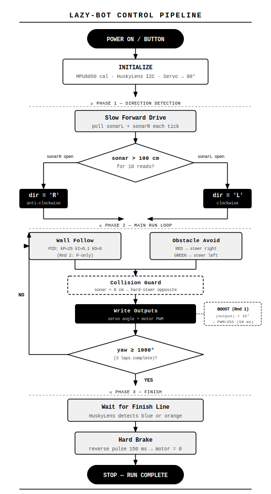

# Lazy-bot — Team Lazy-go | Bangladesh
### WRO Future Engineers 2022


---

## Team

| Name | Email | Discord |
|---|---|---|
| Tausif Samin | tausifsamin.dhk@gmail.com | Ikigai#8742 |
| Iqbal Samin Prithul | prithul0218@gmail.com | Prithul#3957 |


---

## Repository Structure

```
Bangladesh_Team-Lazy-go/
├── src/
│   ├── First_Round/     # PID wall-following (Round 1)
│   └── 2nd_Round/       # Proportional + obstacle avoidance (Round 2)
├── diagrams/            # Generated SVG architecture diagrams
├── schemes/             # Circuit schematics v0.1.4
├── models/              # 3D-printable STL files
├── chassis/             # Chassis assembly documentation
├── v-photos/            # Vehicle photos (all 6 angles)
├── t-photos/            # Team photos
└── others/              # PCB and build photos
```

---

## The Robot

<p align="center">
  
  
  
</p>
<p align="center">
  
  
</p>

---

## Control Pipeline

<p align="center">
  
</p>

### Phase 1 — Direction Detection

The robot drives slowly through the first straight and polls both sonars each tick. Whichever side reads open space (> 100 cm) for 10 consecutive reads sets the direction for the entire run.

### Phase 2 — Main Run Loop

**Round 1 — PID Wall Following**

Tracks the inner wall at a 29 cm setpoint using a full PID controller (`kP=25, kI=0.1, kD=8`).

```
error  = sonar_reading - 29cm
output = kP·e + kI·∫e·dt + kD·(de/dt)
servo  = 92° ± output
speed  = mainSpeed - |output| × 1.3
```

Boost logic: when `|output| < 15°` after a corner, the motor spikes to 255 PWM for 50 ms — a sharp acceleration onto every straight.

**Round 2 — Proportional + Obstacle Avoidance**

PID simplified to P-only for stability at lower speed. HuskyLens overlay adds real-time obstacle steering:

| Object | Response |
|---|---|
| 🔴 Red pillar | Steer right of obstacle |
| 🟢 Green pillar | Steer left of obstacle |
| Distance < 30 cm | Proportional correction from height + X position |

**Collision Guard (both rounds):** if either sonar reads < 8 cm, the servo hard-steers opposite for a few milliseconds.

### Phase 3 — Lap Detection & Stop

```cpp
yawAngle = abs(mpu.getAngleZ()) - startAngle;
// 3 laps × 360° = 1080° (±18° tolerance)
if (yawAngle > 1062 && yawAngle < 1098) endAngleReached++;
if (endAngleReached > 5) waitForFinishLine();  // blue or orange line
// hard brake: reverse pulse (150ms) → motor = 0
```

Gyro drift is negligible over the ~90–120 s run time — integration stays accurate without a magnetometer.

---

## Electrical Design

### Schematic

<p align="center">
  
</p>

### PCB / Board

<p align="center">
  
  &nbsp;&nbsp;
  
</p>
<p align="center">
  
</p>

### Pin Map

| ESP32 Pin | Function |
|---|---|
| 2 | Motor PWM |
| 4 | Motor IN1 |
| 14 | Start button (INPUT_PULLUP) |
| 15 | SonarL trigger/echo |
| 16 | SonarR trigger/echo |
| 25 | Motor IN2 |
| 26 | Motor driver STDBY |
| 33 | Servo PWM |
| SDA/SCL | HuskyLens + MPU6050 (shared I2C bus) |

### Parts List

| Component | Spec | Purpose |
|---|---|---|
| JRC Board | ESP32 @ 240MHz dual-core | Main controller |
| HuskyLens | Kendryte K210 · I2C | Color/object vision |
| HC-SR04 × 2 | Up to 200 cm | Left + right wall distance |
| MPU6050 | 6-DOF IMU | Yaw integration · lap counting |
| DC Geared Motor | 12V · 300RPM (modified) | Rear axle drive |
| 9imod DS20MG | 0.09s/60° @ 7.4V · coreless | Front steering servo |
| VNH2SP30 | 30A peak | Motor driver |
| Pololu U3V70A | Boost → 12V regulated | Stable motor supply |
| MP1584 × 2 | Buck converters | 5V logic rail + 7.4V servo rail |
| 3S LiPo | 12.6V · 1500mAh · XT60 | Main battery (~3 hr runtime) |

---

## Mechanical Design

### Chassis

Base: **YF Robot Ackermann kit** — aluminum base plate, brass spacers, acrylic top plates, significantly modified for competition use. Ackermann steering geometry minimizes tire scrub through corners.

<p align="center">
  
</p>

<p align="center">
  
  &nbsp;&nbsp;
  
</p>

<p align="center">
  
  &nbsp;&nbsp;
  
</p>

<p align="center">
  
  &nbsp;&nbsp;
  
</p>

### 3D Printed Parts

All custom parts designed in-house:

| Part | Purpose |
|---|---|
| Sonar mount (20°) | Angled forward-facing bracket — 20° empirically optimized for maximum lead-time before turns |
| HuskyLens mount | Elevated + angled for optimal field of view of the full track width |
| Wheel A / Wheel B | Full custom wheels — thin profile for precise, low-scrub movement |
| PCB mounting plate | Isolates solder joints from motor body |
| Motor driver mount | Secure VNH2SP30 positioning |

---

## Software Setup

**Requirements:** Arduino IDE (latest), ESP32 board package

1. Install the latest Arduino IDE from [arduino.cc](https://arduino.cc/en/Main/Software).

2. Open File → Preferences and add the following to *Additional Board Manager URLs*:
   ```
   https://raw.githubusercontent.com/espressif/arduino-esp32/gh-pages/package_esp32_index.json
   ```

3. Open Tools → Board → Boards Manager, search for `ESP32`, and install **ESP32 by Espressif Systems**.

4. Select the board: Tools → Board → **DOIT ESP32 DEVKIT V1**

5. Select the correct COM port under Tools → Port.

6. Open the sketch from `src/First_Round/` or `src/2nd_Round/` depending on the round.

7. Click **Upload** and wait for `Done uploading`.

8. Place the robot on the track, power it on, and wait for the servo to center. Press the button to start.

**Libraries required:**
- `NewPing`
- `PIDController`
- `ESP32Servo`
- `HUSKYLENS`
- `MPU6050_light`
